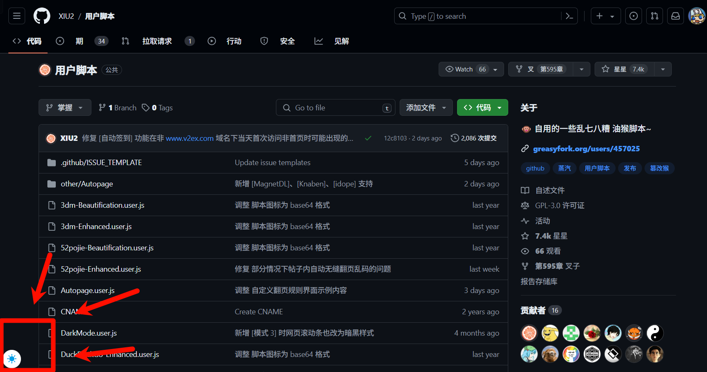

# DarkModeByXIU2_Enhanced

---

## 描述

为[护眼模式 By XIU2](https://github.com/XIU2/UserScript/blob/master/DarkMode.user.js)添加了来自[夜间模式助手](https://github.com/syhyz1990/darkmode)的侧边小按钮，方便快捷开关夜间模式。

## 截图

## 更新日志

- v1.0 - 添加了调整按钮尺寸的功能
- v1.1 - 优化了按钮显示的比例

